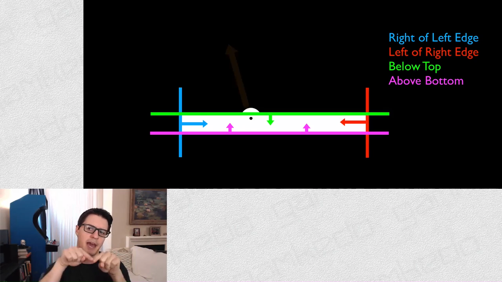

# Первая игра на canvas

В этом обзоре хочу поделиться совей небольшой гордостью - я сделал свою первую игрушку на canvas!

Конечно, это громко сказано - игрушка, сделал сам. Точнее будет сказать - сделал по видео-руководству одного из забугорных ресурсов, посвященных фронтенд-разработке - [Udemy](https://www.udemy.com/ "Udemy").

Но факт остается фактом - хоть и повторял действия, но делал сам, своими руками.

Изучение и работа с Canvas для меня является очень мощным фактром в процессе изучения JavaScript. Благодаря Canvas этот процесс для меня делается интересным и увлекательным.

## Введение

Меньше слов - больше дела. Что должно получиться в итоге? Должна получиться игра такого плана - [Ball and paddle games](http://www.dosgamesarchive.com/category/ball-and-paddle/ "Ball and paddle games").

Данная статья планируется как введение и первый шаг в построении игры такого плана. От простого - к более сложному.

## Базовый Canvas

В этом шаге создаем базовую разметку для будущей игры. Код для HTML-страницы будет предельно простым:


<body>
  <canvas id="canvas"></canvas>
  
</body>


Далее переходим в Javascript и создаем базовые параметры для Canvas:


var canvas;
var ctxCanvas;

window.addEventListener('DOMContentLoaded', function () {

  canvas = document.querySelector('#canvas');
  ctxCanvas = canvas.getContext('2d');

  if ( ctxCanvas ) {

    canvas.width = 800;
    canvas.height = 600;

    ctxCanvas.fillStyle = '#000';
    ctxCanvas.fillRect(0, 0, canvas.width, canvas.height);

    ctxCanvas.fillStyle = '#f00';
    ctxCanvas.beginPath();
    ctxCanvas.arc(50, 50, 10, 0, 360*Math.PI/180, true);
    ctxCanvas.fill();

  }

}, false);


Немного разъяснений по приведенному выше коду.

Создаем пару глобальных переменных - для canvas и для 2d-контекста Canvas:


var canvas;
var ctxCanvas;


Как только DOM-дерево будет рагружено и построено браузером:


window.addEventListener('DOMContentLoaded')


... получаем Canvas и 2d-контекс этого Canvas:


canvas = document.querySelector('#canvas');
ctxCanvas = canvas.getContext('2d');


Затем делаем фоновую заливку цветом для всего Canvas и рисуем мячик (назовем его так), который анимируем в следующем шаге:


ctxCanvas.fillStyle = '#000';
ctxCanvas.fillRect(0, 0, canvas.width, canvas.height);

ctxCanvas.fillStyle = '#f00';
ctxCanvas.beginPath();
ctxCanvas.arc(50, 50, 10, 0, 360*Math.PI/180, true);
ctxCanvas.fill();


Все предельно просто - но это пока только начало.

## Базовая анимация Canvas

Вдохнем немного жизни в Canvas и сделаем для него анимацию. Другими словами, сделаем так, чтобы мячик начал двигаться. Причем, не просто двигаться, а двигаться именно как мячик - чтобы он отскакивал от стенок Canvas.

Для этого нам потребуется базовая функция тайминга JavaScript и немного воображения. Во-первых - что такое Canvas по своей сути? Это все-навсего растровая картинка, которую браузер нарисовал с помощью JavaScript-кода в определенной области.

Ключевое слово здесь - нарисовал. Браузер нарисовал картинку один раз - и "успокоился". Но ни что не мешает нам сделать так, чтобы браузер отрисовывал эту картинку каждый раз заново, через определенный интервал времени, бесконечно долго.

Вот для этого нам и потребуется функция тайминга под названием setInterval(). Внутрь этой функции мы поместим код, который отрисовывает фоновую заливку Canvas и мячик. Зададим интевал времени, через который код будет выполняться каждый раз. И в результате браузер через заданный интервал времени будет каждый раз рисовать новую картинку - получится анимация.

Но чтобы мячик двигался, в каждый промежуток времени у мячика нужно менять его положение на оси Х - другими словами, Х-координату. Для этого сделаем так, чтобы у Х-координаты был свой шаг приращения - допустим, это будет число 5.

Но хватит слов - давайте посмотрим на код и увидим, что твм появилось и зачем:


var canvas;
var ctxCanvas;
var frames = 30;
var ballX = 50;
var ballY = 50;
var ballRadius = 10;
var ballSpeed = 5;

window.addEventListener('DOMContentLoaded', function () {

  canvas = document.querySelector('#canvas');
  ctxCanvas = canvas.getContext('2d');

  if ( ctxCanvas ) {

    canvas.width = 800;
    canvas.height = 600;

    setInterval(function () {

      ballX += ballSpeed;

      if ( ballX > canvas.width ) {
        ballSpeed *= -1;
      }
      if ( ballX < 0 ) {
        ballSpeed *= -1;
      }

      ctxCanvas.fillStyle = '#000';
      ctxCanvas.fillRect(0, 0, canvas.width, canvas.height);

      ctxCanvas.fillStyle = '#f00';
      ctxCanvas.beginPath();
      ctxCanvas.arc(ballX, ballY, ballRadius, 0, 360*Math.PI/180, true);
      ctxCanvas.fill();

    }, 1000/frames);

  }

}, false);


Обратите внимание, что добавилось несколько новых переменных, где ballX - координата мячика по оси Х, ballY - координата мячика по оси Y, ballSpeed - шаг приращения значения по оси Х:


var frames = 30;
var ballX = 50;
var ballY = 50;
var ballRadius = 10;
var ballSpeed = 5;


Движение мячика обеспечивается одной строкой:


...
ballX += ballSpeed;
...


Самым интересным в этом примере кода является участок, где проверяется условие выхода мячика за границы Canvas. Как раз этот код обеспечивает "резиновое" поведение мячика - он отскакивает от стенок Canvas:

 
 if ( ballX > canvas.width ) {
   ballSpeed *= -1;
 }
 if ( ballX < 0 ) {
   ballSpeed *= -1;
 }
 

 Суть метода проста - при достижении предельных границ условий выполняется смена знака у величины приращения ballSpeed - с 5 на -5 и с -5 на 5. Тем самым значение переменной ballX то возрастает до величины, хранимой в canvas.width; то уменьшается до 0. И так  - до бесконечности.

 Настал то момент, когда можно и нужно посмотреть на результат вживую - для этого нужно перейти на страницу CodePen - [Lesson1-1](http://codepen.io/gearmobile/full/QNBjmy/ "Lesson1-1").

 ## Canvas - анимация по оси Y

 Изменим код таким образом, чтобы мячик начал двигаться и по вертикали. Это просто сделать - достаточно добавить шаг приращения по оси Y и проверку условий достижения верхней и нижней границ Canvas (по аналогии с предыдущим примером):


 ...
var ballSpeedX = 5;
var ballSpeedY = 10;
 ...
ballX += ballSpeedX;
ballY += ballSpeedY;
...
if ( ballY > canvas.height ) {
  ballSpeedY *= -1;
}
if ( ballY < 0 ) {
  ballSpeedY *= -1;
}


И снова посмотрим на результат нашей работы - [Lesson1-1](http://codepen.io/gearmobile/full/LNBpoX/ "Lesson1-1"). Не правда ли - замечательно?

Половина дела сделана - тееперь необходимо приступить к созданию paddle и его анимации.

## Canvas - создание и анимация paddle

Что такое paddle? Это маленькая, перемещаемая по-горизонтали или вертикали площадка, которая отбивает мячик. Перемещатся paddle может двумя способами - с помощью мыши и с помощью клавитауры.

В нашем случае paddle будет перемещаться при помощи мыши. Поэтому можно воспользоваться объектом события Event и его свойствами `clientX \ clientY`.

Кроме того, необходимо применить свойство `getBoundingClientRect()` для вычисления отступов Canvas от границ окна браузера. И учитывать при это еще и возможный горизонтальный скролл страницы - свойство `document.documentElement.scrollLetf`.

Кроме того, наш уже созданный код нужно немного реорганизовать и вынести в отдельные функции, чтобы весь код в целом стал более читабельным и легко поддерживаемым.

За отрисовку paddle будет отвечать функция `drawRect()`, а за перемещение paddle по Canvas при движении мыши (событие `mousemove`) будет отвечать функция `paddleMove()`:


 ...
 function paddleMove(event) {
   paddleX = event.clientX - canvas.getBoundingClientRect().left - document.documentElement.scrollLeft;
 }
 ...
 function drawRect(rectX, rectY, rectWidth, rectHeight, rectFill) {
  ctxCanvas.fillStyle = rectFill;
  ctxCanvas.fillRect(rectX, rectY, rectWidth, rectHeight);
}
...
drawRect(0, 0, canvas.width, canvas.height, '#000');
drawBall(ballX, ballY, ballRadius, '#f00');
drawRect(paddleX - paddleWidth/2, ( canvas.height - paddleHeight ) - paddleOffset, paddleWidth, paddleHeight, '#fff');


Стоит обратить внимание на фрагмент кода:


 ...
... paddleX - paddleWidth/2 ...


... здесь из значения X-координаты левого верхнего угла paddle вычитается половина ширины paddle. Это делается для того, чтобы сместить X-координату для paddle на его середину. В результате при движении paddle за левую или правую границу Canvas сам paddle будет скрываться только наполовину.

Переменная paddleOffset служит для того, чтобы приподнять paddle на нижней границей Canvas (причина этого станет ясной несколько позже).

Готовый результат кода можно посмотреть (и почитать) по этой ссылке - [Lesson1-1](http://codepen.io/gearmobile/full/MyBKLP/ "Lesson1-1").

## Canvas - мячик отскакивает от paddle

Теперь необходимо сделать так, чтобы мячик отскакивал от paddle в том случае, когда он попадает на него. Как это сделать? Если подумать, то очень просто. Нужно всего лишь сделать так, чтобы мячик "увидел" границы paddle (то есть - сам paddle).

На данный момент мячик видит только границы Canvas благодаря этому коду:


...
if ( ballX > canvas.width ) {
  ballSpeedX *= -1;
}
if ( ballX < 0 ) {
  ballSpeedX *= -1;
}
if ( ballY > canvas.height ) {
  ballSpeedY *= -1;
}
if ( ballY < 0 ) {
  ballSpeedY *= -1;
}
...


Логично предположить, что нужно просто добавить в этот участок кода еще одно условие - для paddle. Но для этого необходимо знать внешние границы paddle. Для большей ясности я приведу скриншот, на котором автор курса в графическом редакторе показывает, какие именно границы paddle нам необходимы:

